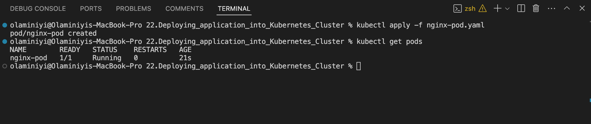

# DEPLOYING APPLICATION INTO KUBERNETES CLUSTER
In this project, I will initiate the deployment of applications within a Kubernetes (K8s) cluster. Kubernetes is a complex system with numerous components, working with multiple layers of abstraction that separate your application from the underlying host machines where it is executed.

we will explore and witness the following aspects in action:

Implementing the deployment of software applications using YAML manifest files, featuring various Kubernetes objects, including:

    - Pods
    - ReplicaSets
    - Deployments
    - StatefulSets
    - Services (ClusterIP, NodeIP, Loadbalancer)
    - Configmaps
    - Volumes
    - PersistentVolumes
    - PersistentVolumeClaims
    And more.

- Understanding the distinctions between stateful and stateless applications.

- Demonstrating the deployment of MySQL as a StatefulSet and providing a rationale for this choice.

- Identifying the limitations associated with deploying applications directly using YAML manifests in Kubernetes.

- Introducing Helm templates, exploring their components, and highlighting the significance of semantic versioning.

- Converting all the existing .yaml templates into a Helm chart for more streamlined management.

- Deploying additional tools on AWS Elastic Kubernetes Service (EKS) using Helm charts, which include:

    - Jenkins
    - MySQL
    - Ingress Controllers (Nginx)
    - Cert-Manager
    - Ingress configurations for Jenkins and the primary application

- Deploying Monitoring Tools, such as Prometheus and Grafana.

 Exploring the concept of Hybrid CI/CD by integrating various tools like Gitlab CI/- CD and Jenkins. Additionally, we'll delve into GitOps principles using Weaveworks Flux.

When utilizing a Kubernetes cluster, the available options vary depending on its intended purpose.

Numerous organizations choose Managed Service solutions for various compelling reasons, such as:

    - Less administrative overheads
    - Reduced cost of ownership
    - Improved Security
    - Seamless support
    - Periodical updates to a stable and well-tested version
    - Faster cluster spin up

However, there is usually strong reasons why organisations with very strict compliance and security concerns choose to build their own Kubernetes clusters. Most of the companies that go this route will mostly use on-premises data centres. When there is need to store data privately due to its sensitive nature, companies will rather not use a public cloud provider. Because, if they do, they have no idea of the physical location of the data centre in which their data is being persisted. Banks and Governments are typical examples of this.

Some setup options can combine both public and private cloud together. For example, the master nodes, etcd clusters, and some worker nodes that run stateful applications can be configured in private datacentres, while worker nodes that require heavy computations and stateless applications can run in public clouds. This kind of hybrid architecture is ideal to satisfy compliance, while also benefiting from other public cloud capabilities.

### install ekctl to interact with Amazon EKS cluster from command prompt
- Install the Weaveworks Homebrew tap.
            brew tap weaveworks/tap
- Install or upgrade eksctl
            brew install weaveworks/tap/eksctl
- Test that your installation was successful with the following command. You must have eksctl 0.34.0 version or later.
            eksctl version
        
 
 
 
 

- Create a cluster using eksctl

            $ eksctl create cluster \
            --name deploy2 \
            --region us-east-1 \
            --nodegroup-name worker \
            --node-type t2.micro \
            --nodes 2      

- check for the resources created in the AWS console

- Connect to the cluster with the below command
            $ aws eks --region us-east-1 update-kubeconfig --name deploy2
    

- check the service 
           kubectl get svc
- check the nodes 
           kubectl get node

## Step 2 : Creating A Pod For The Nginx Application

### Understanding the common YAML fields for every Kubernetes object
Every Kubernetes object includes object fields that govern the object’s configuration:

- kind: Represents the type of kubernetes object created. It can be a Pod, DaemonSet, Deployments or Service.
- version: Kubernetes api version used to create the resource, it can be v1, v1beta and v2. Some of the kubernetes features can be released under beta and available for general public usage.
- metadata: provides information about the resource like name of the Pod, namespace under which the Pod will be running, labels and annotations.
- spec: consists of the core information about Pod. Here we will tell kubernetes what would be the expected state of resource, Like container image, number of replicas, environment variables and volumes.
- status: consists of information about the running object, status of each container. Status field is supplied and updated by Kubernetes after creation. This is not something you will have to put in the YAML manifest.

### Deploying a random Pod
Lets see what it looks like to have a Pod running in a k8s cluster. This section is just to illustrate and get you to familiarise with how the object’s fields work. Lets deploy a basic Nginx container to run inside a Pod.

- apiVersion is v1
- kind is Pod
- metatdata has a name which is set to nginx-pod
- The spec section has further information about the Pod. Where to find the image to run the container – (This defaults to Docker Hub), the port and protocol.

The structure is similar for any Kubernetes objects, and you will get to see them all as we progress.
- Create a Pod yaml manifest name nginx-pod.yaml

                apiVersion: v1
                kind: Pod
                metadata:
                name: nginx-pod
                labels: 
                    app: nginx-pod
                spec:
                containers:
                - image: nginx:latest
                    name: nginx-pod
                    ports:
                    - containerPort: 80
                    protocol: TCP
              

- Apply the manifest with the help of kubectl
                    kubectl apply -f nginx-pod.yaml

- Get an output of the pods running in the cluster
                    kubectl get pods

### Note: pods status was pending for a long period of time when i ran kubectl get pods command.
### i checked further with kubectl describe pod nginx-pod command, there was "Scheduling error"
### i deleted the cluster and created a new cluster with 2 nodes and it was sorted

To see other fields introduced by kubernetes after you have deployed the resource, simply run below command, and examine the output. You will see other fields that kubernetes updates from time to time to represent the state of the resource within the cluster. -o simply means the output format.

                    kubectl get pod nginx-pod -o yaml 

 

                    kubectl describe pod nginx-pod

### Creating a Replical set
Let us create a rs.yaml manifest for a ReplicaSet object:

                    #Part 1
                    apiVersion: apps/v1
                    kind: ReplicaSet
                    metadata:
                    name: nginx-rs
                    spec:
                    replicas: 3
                    selector:
                        matchLabels:
                        app: nginx-pod
                    #Part 2
                    template:
                        metadata:
                        name: nginx-pod
                        labels:
                            app: nginx-pod
                        spec:
                        containers:
                        - image: nginx:latest
                            name: nginx-pod
                            ports:
                            - containerPort: 80
                            protocol: TCP

- apply it with

                kubectl apply -f rs.yaml

The manifest file of ReplicaSet consist of the following fields:
- apiVersion: This field specifies the version of kubernetes Api to which the object belongs. ReplicaSet belongs to apps/v1 apiVersion.
- kind: This field specify the type of object for which the manifest belongs to. Here, it is ReplicaSet.
- metadata: This field includes the metadata for the object. It mainly includes two fields: name and labels of the ReplicaSet.
- spec: This field specifies the label selector to be used to select the Pods, number of replicas of the Pod to be run and the container or list of containers which the Pod will run. In the above example, we are running 3 replicas of nginx container.

Let us check what Pods have been created:
        kubectl get pods

Here we see three ngix-pods with some random suffixes (e.g., -dzlrm) – it means, that these Pods were created and named automatically by some other object (higher level of abstraction) such as ReplicaSet.

Try to delete one of the Pods:

        kubectl delete pod nginx-rs-fpdgj

You can see, that we still have all 3 Pods, but one has been recreated
Explore the ReplicaSet created:

        kubectl get rs -o wide

## the pending pod out of the 3 pods is as a result not sufficient nodes, also i used t2 micro. it will be fixed by creating more nodes to the cluster. is more efficient to use t3 micro.

Notice, that ReplicaSet understands which Pods to create by using SELECTOR key-value pair.

### Get detailed information of a ReplicaSet
To display detailed information about any Kubernetes object, you can use 2 differen commands:
- kubectl describe %object_type% %object_name% (e.g. kubectl describe rs nginx-rs)
- kubectl get %object_type% %object_name% -o yaml (e.g. kubectl describe rs nginx-rs -o yaml)

Try both commands in action and see the difference. Also try get with -o json instead of -o yaml and decide for yourself which output option is more readable for you.

### Scale ReplicaSet up and down:
In general, there are 2 approaches of Kubernetes Object Management: imperative and declarative.

Let us see how we can use both to scale our Replicaset up and down:

Imperative:
We can easily scale our ReplicaSet up by specifying the desired number of replicas in an imperative command, like this:

            kubectl scale rs nginx-rs --replicas=5
- check the output:
             kubectl get pods

Scaling down will work the same way, so scale it down to 3 replicas.

Declarative:
Declarative way would be to open our rs.yaml manifest, change desired number of replicas in respective section
            spec:
            replicas: 3       

and applying the updated manifest:
            kubectl apply -f rs.yaml

There is another method – ‘ad-hoc’, it is definitely not the best practice and we do not recommend using it, but you can edit an existing ReplicaSet with following command:
            kubectl edit -f rs.yaml

### Advanced label matching
As Kubernetes mature as a technology, so does its features and improvements to k8s objects. ReplicationControllers do not meet certain complex business requirements when it comes to using selectors. Imagine if you need to select Pods with multiple lables that represents things like:

- Application tier: such as Frontend, or Backend
- Environment: such as Dev, SIT, QA, Preprod, or Prod
So far, we used a simple selector that just matches a key-value pair and check only ‘equality’:
            selector:
                app: nginx-pod

But in some cases, we want ReplicaSet to manage our existing containers that match certain criteria, we can use the same simple label matching or we can use some more complex conditions, such as:
            - in
            - not in
            - not equal
            - etc...

Let us look at the following manifest file: update the rs.yaml with the following 

            apiVersion: apps/v1
            kind: ReplicaSet
            metadata: 
            name: nginx-rs
            spec:
            replicas: 3
            selector:
                matchLabels:
                env: prod
                matchExpressions:
                - { key: tier, operator: In, values: [frontend] }
            template:
                metadata:
                name: nginx
                labels: 
                    env: prod
                    tier: frontend
                spec:
                containers:
                - name: nginx-container
                    image: nginx:latest
                    ports:
                    - containerPort: 80
                    protocol: TCP

In the above spec file, under the selector, matchLabels and matchExpression are used to specify the key-value pair. The matchLabel works exactly the same way as the equality-based selector, and the matchExpression is used to specify the set based selectors. This feature is the main differentiator between ReplicaSet and previously mentioned obsolete ReplicationController.

- delete the existing replica set with this command 
                kubectl delete rs nginx-rs
    
- create a new replica set with the updated file
                kubectl apply -f rs.yaml

- get the replication set now:
               kubectl get rs nginx-rs -o wide 

        

### Step 4: Creating Deployment
Do not Use Replication Controllers – Use Deployment Controllers Instead Kubernetes is loaded with a lot of features, and with its vibrant open source community, these features are constantly evolving and adding up.

Previously, you have seen the improvements from ReplicationControllers (RC), to ReplicaSets (RS). In this section you will see another K8s object which is highly recommended over Replication objects (RC and RS).

A Deployment is another layer above ReplicaSets and Pods, newer and more advanced level concept than ReplicaSets. It manages the deployment of ReplicaSets and allows for easy updating of a ReplicaSet as well as the ability to roll back to a previous version of deployment. It is declarative and can be used for rolling updates of micro-services, ensuring there is no downtime.

Officially, it is highly recommended to use Deplyments to manage replica sets rather than using replica sets directly.

Let us see Deployment in action.

- firstly, delete the existing replica set
            kubectl delete rs nginx-rs

- Understand the layout of the deployment.yaml manifest below. Lets go through the 3 separated sections:

                # Section 1 - This is the part that defines the deployment
                apiVersion: apps/v1
                kind: Deployment
                metadata:
                name: nginx-deployment
                labels:
                    tier: frontend

                # Section 2 - This is the Replica set layer controlled by the deployment
                spec:
                replicas: 3
                selector:
                    matchLabels:
                    tier: frontend

                # Section 3 - This is the Pod section controlled by the deployment and selected by the replica set in section 2.
                template:
                    metadata:
                    labels:
                        tier: frontend
                    spec:
                    containers:
                    - name: nginx
                        image: nginx:latest
                        ports:
                        - containerPort: 80

- Putting them altogether

                    apiVersion: apps/v1
                    kind: Deployment
                    metadata:
                    name: nginx-deployment
                    labels:
                        tier: frontend
                    spec:
                    replicas: 3
                    selector:
                        matchLabels:
                        tier: frontend
                    template:
                        metadata:
                        labels:
                            tier: frontend
                        spec:
                        containers:
                        - name: nginx
                            image: nginx:latest
                            ports:
                            - containerPort: 80

- create the deployment:

                    kubectl apply -f deployment.yaml

